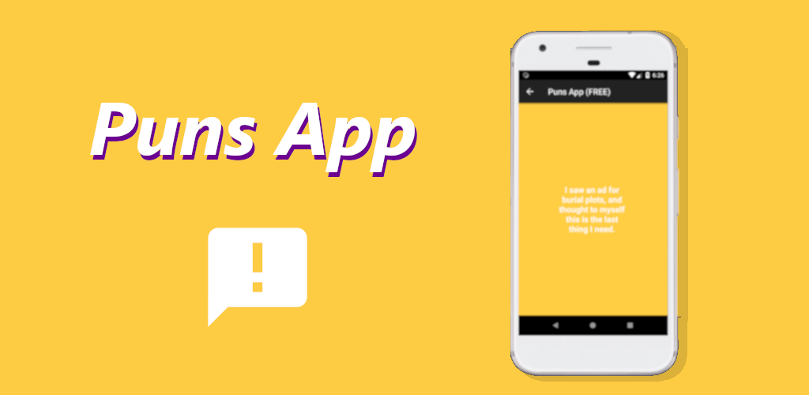

# Android puns app



<a href='https://play.google.com/store/apps/details?id=com.udacity.gradle.builditbigger.free&pcampaignid=MKT-Other-global-all-co-prtnr-py-PartBadge-Mar2515-1'></a>

Android app that displays puns. Very useful indeed.

# Features

- Uses Local Google Cloud Endpoint Server to retrieve the puns.
- Has a Java library module to generate the puns (which is used by the GCE module).
- Has s Android library module that contains an activity to display a pun.
- Has paid and free versions. The free versions display adds and the paid version don't. Each one had its own icon.
- Puns everywhere. In the code and in the commit messages.

# Screenshots

<p float="left" align="center">
  
   
</p>

# Setup

## Requirements

- Have Google Cloud SDK installed ([how to install Google Cloud SDK?](https://cloud.google.com/sdk/docs/)). This is optional, you can just set a flag to true in your gradle.properties file to ignore this step.

## Steps

Clone the repository

````
git clone https://github.com/Artenes/JokesApp
````

Add the following variable to your gradle.properties file (~/.gradle/gradle.properties)

````
JokesApp_UseFakeServer=false
````

If you set this variable to ``true``, then it will not be required to have Google Cloud SDK installed. The library that serves the puns will be accessed directly by the app.

Finally, import the project in Android Studio.

Before running the app or the tests, run in the terminal

````
gradlew appengineRun
````

for this you must have installed the Google Cloud Endpoint Server in your machine.

# Credits

Puns were taken from [A giant list of puns post in reddit](https://www.reddit.com/r/dadjokes/comments/76jfme/a_giant_list_of_puns/)

# License

MIT License